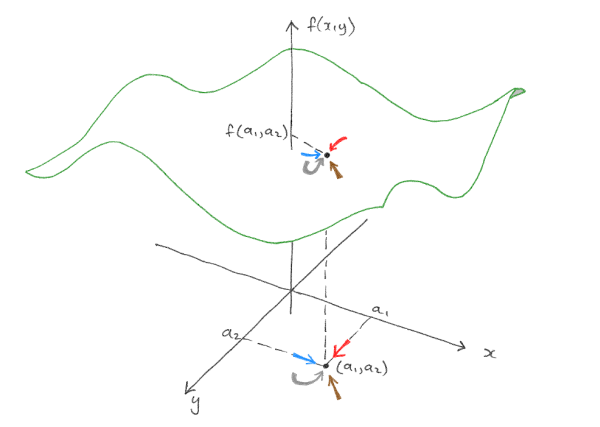

class:  middle

```{r setup, include=FALSE}
knitr::opts_chunk$set(echo = FALSE, message = FALSE, warning = FALSE)

options(htmltools.dir.version = FALSE)
options(tinytex.engine_args = '-shell-escape')
```

```{r load_packages, message=FALSE, warning=FALSE, include=FALSE} 
library(fontawesome)
```


# Tema 1: Funciones reales de varias variables

[1. Funciones de varias variables](#apartado-1)

[2. Dominio y curvas de nivel](#apartado-2)

[3. Límites y continuidad de funciones de varias variables](#apartado-3)

---
name: apartado-1
class: middle, center, inverse

# 1. Funciones de varias variables

---


## Nociones topológicas en $\mathbb{R}^n$

$n=1,\, \mathbb{R}$ es la recta unidimensional

.center2[
```{r,engine='tikz'}
  \begin{tikzpicture}
    \draw [<->](-3,0) -- (3,0);
    \foreach \i in {-2,...,2} % numbers on line
      \draw (\i,0.1) -- + (0,-0.2) node[below] {$\i$}; % tick and their labels
  \node [above] at (0,0.2) {${\rm I\!R}$};
  \node [below] at (3,-0.1) {$\infty$};
  \node [below] at (-3,-0.1) {$-\infty$};
  \end{tikzpicture}
```
]

---

## Nociones topológicas en $\mathbb{R}^n$ (cont.)

$n=2,\, \mathbb{R}^2$ es el plano real [`r fa("external-link-alt", fill = "#cc0033")`](https://www.geogebra.org/m/daguw2br)

$$n=2\rightarrow \mathbb{R}^2 = \mathbb{R}\times \mathbb{R} =\left\{(x_1,x_2):x_i\in\mathbb{R},i=1,2\right\}$$


```{r,engine='tikz', fig.ext = 'svg', fig.width=2, fig.align='center'}
\begin{tikzpicture}[scale=3,cap=round]
% Styles
\tikzstyle{axes}=[]

\draw[style=help lines,step=0.5cm] (-1.4,-1.4) grid (1.4,1.4);

\begin{scope}[style=axes]
  \draw[->] (-1.5,0) -- (1.5,0) node[right] {$x$} coordinate(x axis);
  \draw[->] (0,-1.5) -- (0,1.5) node[above] {$y$} coordinate(y axis);

  \foreach \x/\xtext in {-1, -.5/-\frac{1}{2}, .5/\frac{1}{2}, 1}
    \draw[xshift=\x cm] (0pt,1pt) -- (0pt,-1pt) node[below,fill=white] {$\xtext$};

  \foreach \y/\ytext in {-1, -.5/-\frac{1}{2}, .5/\frac{1}{2}, 1}
    \draw[yshift=\y cm] (1pt,0pt) -- (-1pt,0pt) node[left,fill=white] {$\ytext$};

\end{scope}

\draw[->, red] (0.1,0.1) -- (0.1,0.5);
\draw[->, red] (0.1,0.1) -- (0.5,0.1);
\fill[red!80!white] (0.5,0.5) circle (0.5pt) node[right]{$(x_0,y_0)$};

\end{tikzpicture}
```


---

## Nociones topológicas en $\mathbb{R}^n$ (cont.)

$n=3,\, \mathbb{R}^3$ es el espacio real tridimensional [`r fa("external-link-alt", fill = "#cc0033")`](https://www.geogebra.org/m/hpr2yzvy)

$$n=3\rightarrow \mathbb{R}^3 = \mathbb{R}\times \mathbb{R} \times \mathbb{R} =\left\{(x_1,x_2, x_3):x_i\in\mathbb{R},i=1,2,3\right\}$$

```{r, engine='tikz', fig.ext = 'svg', fig.width=2, fig.align='center', engine.opts = list(template = "latex/tikz2pdf.tex")}
\begin{tikzpicture}
    \begin{axis}[
        width=8cm,
        height=8cm,
        grid = major,
        %grid style={dashed, gray!50},
        scale only axis,
        xmin=-2, xmax=2,
        xtick={-2,-1,0,1,2},
        xlabel={X},
        ymin=-2, ymax=2,
        ytick={-2,-1,0,1,2},
        ylabel={Y},
        zmin=-2, zmax=2,
        ztick={-2,-1,0,1,2},
        zlabel={Z},
        3d box=background,
        view={322.5}{30},]
    
    \addplot3 [
        color=black,
        mark size=2.5pt,
        only marks,
        mark=*,
        mark options={solid}]
    table {
        -0.25 -0.25 3
    };
    
    
    \draw[->] (axis cs:-1.9,0,0) -- (axis cs:1.9,0,0) node[right] {$x$};
    \draw[->] (axis cs:0,-1.9,0) -- (axis cs:0,1.9,0) node[right] {$y$};
    \draw[->] (axis cs:0,0,-1.9) -- (axis cs:0,0,1.9) node[right] {$z$};
    \draw[red, ->] (axis cs:0,0,0) -- (axis cs:0.5,0,0);
    \draw[red, ->] (axis cs:0,0,0) -- (axis cs:0,0.5,0);
    \draw[red, ->] (axis cs:0,0,0) -- (axis cs:0,0,0.5);
    \fill[red] (axis cs:0,-0.7,1) circle (2pt) node[right] {$(x_0,y_0,z_0)$};
    \end{axis}

    


    \end{tikzpicture}
```


---

## Nociones topológicas en $\mathbb{R}^n$ (cont.)

En general para $n\in \mathbb{N},\, \mathbb{R}^n$ es un espacio n-dimensional

$$\mathbb{R}^n = \mathbb{R}\times \cdots \times \mathbb{R} =\left\{(x_1,\ldots, x_n):x_i\in\mathbb{R},i=1,\ldots,n\right\}$$

- Vector en $\mathbb{R}^n$

$$\vec{x}=(x_1,\ldots, x_n) \rightarrow \begin{pmatrix}x_1\\ \vdots\\ x_n\end{pmatrix}$$

---

## Operaciones con vectores

### Suma de vectores [`r fa("external-link-alt", fill = "#cc0033")`](https://www.matematicasonline.es/cuarto-eso/geogebra/suma-resta-vectores/index.html)

$$\vec{x},\vec{y}\in \mathbb{R}^n,\, \vec{x}=(x_1,\ldots, x_n),\, \vec{y}=(y_1,\ldots, y_n)$$
$$\vec{x}+\vec{y}=(x_1+y_1,\ldots, x_n+y_n)$$


```{r,engine='tikz', fig.ext = 'svg', fig.width=4, fig.align='center'}
\usetikzlibrary{arrows.meta} 
\begin{tikzpicture}[scale=3,cap=round]
% Styles
\tikzstyle{axes}=[]

\draw[style=help lines,step=0.5cm] (-1.4,-1.4) grid (1.4,1.4);

\begin{scope}[style=axes]
  \draw[->] (-1.5,0) -- (1.5,0) node[right] {$x$} coordinate(x axis);
  \draw[->] (0,-1.5) -- (0,1.5) node[above] {$y$} coordinate(y axis);

  \foreach \x/\xtext in {-1, -.5/-\frac{1}{2}, .5/\frac{1}{2}, 1}
    \draw[xshift=\x cm] (0pt,1pt) -- (0pt,-1pt) node[below,fill=white] {$\xtext$};

  \foreach \y/\ytext in {-1, -.5/-\frac{1}{2}, .5/\frac{1}{2}, 1}
    \draw[yshift=\y cm] (1pt,0pt) -- (-1pt,0pt) node[left,fill=white] {$\ytext$};

\end{scope}

\draw[-Stealth, red, very thick] (0,0) -- node [left] {${\bar{u}}$} (0.3,1.2) ;
\draw[-Stealth, blue, very thick] (0,0) -- node [above] {${\bar{v}}$} (0.8,0.1) ;
\draw[-Stealth, red, xshift=0.8cm,yshift=0.1cm, dashed, thick] (0,0) -- (0.3,1.2);
\draw[-Stealth, blue, xshift=0.3cm,yshift=1.2cm,dashed, thick] (0,0) -- (0.8,0.1);
\draw[-Stealth, green, very thick] (0,0) -- node[below=2pt,fill=white] {${\bar{u}}+{\bar{v}}$} (1.1,1.3);


\end{tikzpicture}
```


---

## Operaciones con vectores (cont.) 

### Producto de un escalar por un vector

$$\lambda\in \mathbb{R},\, \vec{x}\in \mathbb{R}^n,\, \vec{x}=(x_1,\ldots, x_n)$$
$$\lambda\vec{x}=\lambda (x_1,\ldots, x_n) =( \lambda x_1,\ldots, \lambda x_n)$$


```{r,engine='tikz', fig.ext = 'svg', fig.width=4, fig.align='center'}
\usetikzlibrary{arrows.meta} 
\begin{tikzpicture}[scale=3,cap=round]
% Styles
\tikzstyle{axes}=[]

\draw[style=help lines,step=0.5cm] (-1.4,-1.4) grid (1.4,1.4);

\begin{scope}[style=axes]
  \draw[->] (-1.5,0) -- (1.5,0) node[right] {$x$} coordinate(x axis);
  \draw[->] (0,-1.5) -- (0,1.5) node[above] {$y$} coordinate(y axis);

  \foreach \x/\xtext in {-1, -.5/-\frac{1}{2}, .5/\frac{1}{2}, 1}
    \draw[xshift=\x cm] (0pt,1pt) -- (0pt,-1pt) node[below,fill=white] {$\xtext$};

  \foreach \y/\ytext in {-1, -.5/-\frac{1}{2}, .5/\frac{1}{2}, 1}
    \draw[yshift=\y cm] (1pt,0pt) -- (-1pt,0pt) node[left,fill=white] {$\ytext$};

\end{scope}


\draw[-Stealth, blue, very thick] (0,0) -- (0.5,0.3) node [above] {$\bar{v}$};
\draw[-Stealth, red, thick] (0,0) -- (0.5,0.3);
\draw[-Stealth, red, thick] (0.5,0.3) -- (1,0.6);
\draw[-Stealth, red, thick] (1,0.6) -- (1.5,0.9) node [above] {${3\bar{v}}$};


\end{tikzpicture}
```


---

## Operaciones con vectores (cont.)

### Combinación lineal de vectores

$$\vec{z}=\alpha\vec{x}+\beta \vec{y}\in \mathbb{R}^n$$
$$\vec{z}=\alpha\vec{x}+\beta \vec{y} = \alpha (x_1,\ldots, x_n) + \beta (y_1,\ldots, y_n)=\\ (\alpha x_1,\ldots, \alpha x_n) +  (\beta y_1,\ldots, \beta y_n) = (\alpha x_1 + \beta y_1,\ldots, \alpha x_n + \beta y_n)$$
```{r,engine='tikz', fig.ext = 'svg', fig.width=4, fig.align='center', out.width="30%"}
\usetikzlibrary{arrows.meta} 
\begin{tikzpicture}[scale=3,cap=round]
% Styles
\tikzstyle{axes}=[]

\draw[style=help lines,step=0.5cm] (-1.4,-1.4) grid (1.4,1.4);

\begin{scope}[style=axes]
  \draw[->] (-1.5,0) -- (1.5,0) node[right] {$x$} coordinate(x axis);
  \draw[->] (0,-1.5) -- (0,1.5) node[above] {$y$} coordinate(y axis);

  \foreach \x/\xtext in {-1, -.5/-\frac{1}{2}, .5/\frac{1}{2}, 1}
    \draw[xshift=\x cm] (0pt,1pt) -- (0pt,-1pt) node[below,fill=white] {$\xtext$};

  \foreach \y/\ytext in {-1, -.5/-\frac{1}{2}, .5/\frac{1}{2}, 1}
    \draw[yshift=\y cm] (1pt,0pt) -- (-1pt,0pt) node[left,fill=white] {$\ytext$};

\end{scope}


\draw[-Stealth, blue, thick] (0,0) -- (1.2,0);
\draw[-Stealth, blue, thick] (0,0) -- (0.2,0.6);
\draw[-Stealth, dashed, xshift = 1.2cm] (0,0) -- (0.2,0.6);
\draw[-Stealth, dashed, xshift = 0.2cm, yshift = 0.6cm] (0,0) -- (1.2,0);
\draw[-Stealth, red, thick] (0,0) -- node [left, fill=white] {$3\bar{u}+2\bar{v}$} (1.4,0.6);

\draw[-Stealth, teal, thick] (0,0) -- (0.8,0);
\draw[-Stealth, teal, thick] (0,0) -- (-0.3,-0.9);
\draw[-Stealth, dashed, xshift = 0.8cm] (0,0) -- (-0.3,-0.9);
\draw[-Stealth, dashed, xshift = -0.3cm, yshift = -0.9cm] (0,0) -- (0.8,0);
\draw[-Stealth, red, thick] (0,0) -- node [right, fill=white] {$2\bar{u}-3\bar{v}$} (0.5,-0.9);


\draw[-Stealth, magenta, thick] (0,0) -- (-1.4,0);
\draw[-Stealth, magenta, thick] (0,0) -- (-0.15,-0.45);
\draw[-Stealth, dashed, xshift = -1.4cm] (0,0) -- (-0.15,-0.45);
\draw[-Stealth, dashed, xshift = -0.15cm, yshift = -0.45cm] (0,0) -- (-1.4,0);
\draw[-Stealth, red, thick] (0,0) -- node [left, fill=white] {$-3.5\bar{u}-1.5\bar{v}$} (-1.55,-0.45);

\draw[-Stealth, gray, thick] (0,0) -- (-0.8,0);
\draw[-Stealth, gray, thick] (0,0) -- (0.1,0.3);
\draw[-Stealth, dashed, xshift = -0.8cm] (0,0) -- (0.1,0.3);
\draw[-Stealth, dashed, xshift = 0.1cm, yshift = 0.3cm] (0,0) -- (-0.8,0);
\draw[-Stealth, red, thick] (0,0) -- node [fill=white] {$-2\bar{u}+\bar{v}$} (-0.7,0.3);


\draw[-Stealth,  very thick] (0,0) -- node [below] {$\bar{v}$} (0.4,0) ;
\draw[-Stealth,  very thick] (0,0) -- node [left] {$\bar{u}$} (0.1,0.3);


\end{tikzpicture}
```
---

## Operaciones con vectores (cont.)

### Producto escalar de vectores

$$\vec{x},\vec{y}\in \mathbb{R}^n,\, \vec{x}=(x_1,\ldots, x_n),\, \vec{y}=(y_1,\ldots, y_n)$$

$$\langle\vec{x},\vec{y}\rangle = \vec{x}=(x_1,\ldots, x_n)\begin{pmatrix}x_1\\ \vdots\\ x_n\end{pmatrix} = x_1y_1+\cdots+x_ny_n$$

---
## Operaciones con vectores (cont.)

### Norma euclídea [`r fa("external-link-alt", fill = "#cc0033")`](https://www.geogebra.org/m/mnx3q4sm)


$$\vec{x}\in \mathbb{R}^n,\, \vec{x}=(x_1,\ldots, x_n)$$
$$\lVert\vec{x}\rVert=\sqrt{x_1^2+\ldots+x_n^2}=\sqrt{\sum^n_{i=1}x^2_i}$$
```{r,engine='tikz', fig.ext = 'svg', fig.width=3, fig.align='center', out.width= "30%"}

\usetikzlibrary{angles, arrows.meta, quotes, calc}
\begin{tikzpicture}[scale=3,cap=round]
% Styles
\tikzstyle{axes}=[]

\draw[style=help lines,step=0.5cm] (-1.4,-1.4) grid (1.4,1.4);

\begin{scope}[style=axes]
  \draw[->] (-1.5,0) -- (1.5,0) node[right] {$x$} coordinate(x axis);
  \draw[->] (0,-1.5) -- (0,1.5) node[above] {$y$} coordinate(y axis);

  \foreach \x/\xtext in {-1, -.5/-\frac{1}{2}, .5/\frac{1}{2}, 1}
    \draw[xshift=\x cm] (0pt,1pt) -- (0pt,-1pt) node[below,fill=white] {$\xtext$};

  \foreach \y/\ytext in {-1, -.5/-\frac{1}{2}, .5/\frac{1}{2}, 1}
    \draw[yshift=\y cm] (1pt,0pt) -- (-1pt,0pt) node[left,fill=white] {$\ytext$};

\end{scope}


\coordinate (A) at (0cm,0cm);

\draw[-Stealth, blue]
        (A) to ["$\bar{x}$" '] ++ ({atan(1)}:{sqrt(2)})  coordinate (B);
        
\draw[-Stealth, red]
(A) to ["$x_0$" ']     ++ (0:1)  coordinate (C);

\draw[-Stealth, red]
        (C) to ["$y_0$" ']     ++ (90:1);


\draw[{Bar[width=3.4mm]Straight Barb[]}-{Straight Barb[]Bar[width=3.4mm]}]
        ($(A)!1mm!90:(B)$) to ["$\vert\vert\bar{x}\vert\vert$",sloped] + ({atan(1)}:{sqrt(2)});          


\end{tikzpicture}


```


---
background-image: url(https://cdn.kastatic.org/ka-perseus-images/6ade290db694921cc465883fb070d8a1dbb3447e.png)
background-position: 80% 80%
background-size: 190pt

## Operaciones con vectores (cont.)

### Norma euclídea (cont.)

#### Propiedades

.pull-left[
1. $\lVert\vec{x}\rVert\geq 0,\quad \lVert\vec{x}\rVert=0 \iff \vec{x}=\vec{0}$

2. $\lVert\lambda \vec{x}\rVert = \lambda \lVert \vec{x}\rVert$

3. $\lVert\vec{x} + \vec{y}\rVert \leq  \lVert \vec{x}\rVert + \lVert \vec{y}\rVert$

4. $\left\lVert\frac{\vec{x}}{\lVert\vec{x}\rVert}\right\rVert = 1,\, \forall \vec{x}\neq \vec{0}$
]

.pull-right[
```{r,engine='tikz', fig.ext = 'svg', fig.width=4, fig.align='center', out.width='60%'}
\usetikzlibrary{ arrows.meta}
\begin{tikzpicture}[scale=3,cap=round]

\draw[red, very thick] (0,0) -- node [left] {$\vert\vert\bar{x}\vert\vert$} (1,1);
\draw[blue, very thick] (1,1) -- node [right] {$\vert\vert\bar{y}\vert\vert$} (2,0);
\draw[green, very thick] (0,0) -- node [below] {$\vert\vert\bar{x}+\bar{y}\vert\vert$} (2,0);


\end{tikzpicture}
```

]
---

## Operaciones con vectores (cont.)

### Distancia euclídea (cont.)

$$\vec{x},\vec{y}\in \mathbb{R}^n,\, \vec{x}=(x_1,\ldots, x_n),\, \vec{y}=(y_1,\ldots, y_n)$$

  $$d(\vec{x},\vec{y})=\lVert\vec{x}-\vec{y}\rVert = \sqrt{(x_1-y_1)^2 + \ldots (x_n-y_n)^2 } = \sqrt{\sum^n_{i=1}(x_i-y_i)^2}$$
```{r,engine='tikz', fig.ext = 'svg', fig.width=4, fig.align='center', out.width='30%'}
\usetikzlibrary{angles, arrows.meta, quotes, calc}
\begin{tikzpicture}[scale=3,cap=round]
% Styles
\tikzstyle{axes}=[]

\draw[style=help lines,step=0.5cm] (-1.4,-1.4) grid (1.4,1.4);

\begin{scope}[style=axes]
  \draw[->] (-1.5,0) -- (1.5,0) node[right] {$x$} coordinate(x axis);
  \draw[->] (0,-1.5) -- (0,1.5) node[above] {$y$} coordinate(y axis);

  \foreach \x/\xtext in {-1, -.5/-\frac{1}{2}, .5/\frac{1}{2}, 1}
    \draw[xshift=\x cm] (0pt,1pt) -- (0pt,-1pt) node[below,fill=white] {$\xtext$};

  \foreach \y/\ytext in {-1, -.5/-\frac{1}{2}, .5/\frac{1}{2}, 1}
    \draw[yshift=\y cm] (1pt,0pt) -- (-1pt,0pt) node[left,fill=white] {$\ytext$};

\end{scope}

\draw[-Stealth, red, very thick] (0,0) -- node [left] {$\bar{u}$} (0.3,1.2) ;
\draw[-Stealth, blue, very thick] (0,0) -- node [left] {$\bar{v}$} (0.8,0.1) ;

\draw[-Stealth, green, very thick] (0.3,1.2) -- node[above=4pt,fill=white,below, sloped] {$\bar{u}-\bar{v}$} (0.8,0.1);
\draw[{Bar[width=3.4mm]Straight Barb[]}-{Straight Barb[]Bar[width=3.4mm]}]
        ($(0.3,1.2)!1mm!90:(0.8,0.1)$) to [sloped,"${\vert\vert\bar{u}-\bar{v}\vert\vert=d(\bar{u},\bar{v})}$"] ($(0.8,0.1)!1mm!-90:(0.3,1.2)$); 


\end{tikzpicture}
```


---


## Operaciones con vectores (cont.)

### Distancia euclídea (cont.)

#### Propiedades

1. $d(\vec{x},\vec{y})\geq 0$

2. $d(\vec{x},\vec{y}) = 0 \iff \vec{x}=\vec{y}$

3. $d(\vec{x},\vec{y}) =  d(\vec{y},\vec{x})$

4. $d(\vec{x},\vec{y}) \leq  d(\vec{x},\vec{z}) + d(\vec{z},\vec{y})$


---

## Bolas en $\mathbb{R}^n$

- Bola abierta con centro en $\vec{x}_0\in \mathbb{R}^n$ y radio $r\in \mathbb{R}$

$$B(\vec{x}_0,r) = \{\vec{x}\in\mathbb{R}^n:d(\vec{x},\vec{x}_0)<r\}$$
- Bola cerrada con centro en $\vec{x}_0\in \mathbb{R}^n$ y radio $r\in \mathbb{R}$

$$\overline{B}(\vec{x}_0,r) = \{\vec{x}\in\mathbb{R}^n:d(\vec{x},\vec{x}_0)\leq r\}$$


---

## Bolas en $\mathbb{R}^n$ (cont.)

### $n=1$

- Bola abierta con centro en $x_0\in \mathbb{R}$ y radio $r\in \mathbb{R}$

$$B(x_0,r) = \{x\in\mathbb{R}:d(x,x_0)<r\} = (x-x_0, x+x_0)$$
```{r, engine ='tikz'}
\usetikzlibrary{arrows}
\begin{tikzpicture}
\draw[<->, thick] (-3,0) -- (3,0);

\foreach \x/\xtext in {-1.8/$x_0-r$,0/$x_0$,1.8/$x_0+r$}
    \draw[thick] (\x,2pt) -- (\x,-2pt) node[below] {\xtext};

\draw[(-), thick, blue] (-1.8,0) -- (1.8,0);
\draw (-4.25,0) node {$B(x_0,r)$};
\end{tikzpicture}

```


- Bola cerrada con centro en $x_0\in \mathbb{R}$ y radio $r\in \mathbb{R}$

$$\overline{B}(x_0,r) = \{x\in\mathbb{R}:d(x,x_0)\leq r\} = [x-x_0, x+x_0]$$

```{r, engine ='tikz'}
\usetikzlibrary{arrows}
\begin{tikzpicture}
\draw[<->, thick] (-3,0) -- (3,0);

\foreach \x/\xtext in {-1.8/$x_0-r$,0/$x_0$,1.8/$x_0+r$}
    \draw[thick] (\x,2pt) -- (\x,-2pt) node[below] {\xtext};

\draw[{[-]}, thick, blue] (-1.8,0) -- (1.8,0);
\draw (-4.25,0) node {$\overline{B}(x_0,r)$};
\end{tikzpicture}

```
---

## Bolas en $\mathbb{R}^n$ (cont.)

### $n=2$ [`r fa("external-link-alt", fill = "#cc0033")`](https://www.geogebra.org/m/mj4cqunw)


- Bola abierta con centro en $\vec{x}_0=(x_0,y_0)\in \mathbb{R}^2$ y radio $r\in \mathbb{R}$

$$B(\vec{x}_0,r) = \{x\in\mathbb{R}^2:d(\vec{x},\vec{x}_0)<r\} = \{\vec{x}=(x,y)\in \mathbb{R}^2:(x-x_0)^2+(y-y_0)^2<r^2\}$$


```{r,engine='tikz', eval = TRUE, fig.ext = 'svg', out.width='30%', fig.align='center',cache = TRUE}

\begin{tikzpicture}[scale=2]
\tikzstyle{axes}=[]
\begin{scope}[style=axes]
  \draw[->] (3.5,0) -- (6.5,0) node[right] {$x$} coordinate(x axis);
  \draw[->] (5,-1.5) -- (5,1.5) node[above] {$y$} coordinate(y axis);

  \foreach \x/\xtext in {4/-1, 4.5/-\frac{1}{2}, 5.5/\frac{1}{2}, 6/1}
    \draw[xshift=\x cm] (5pt,1pt) -- (5pt,-1pt) node[below,fill=white] {$\xtext$};

  \foreach \y/\ytext in {-1/-1, -0.5/-\frac{1}{2}, 0.5/\frac{1}{2}, 1/1}
    \draw[xshift = 5cm,  yshift=\y cm] (1pt,0pt) -- (-1pt,0pt) node[left,fill=white] {$\ytext$};

\end{scope}

\filldraw [orange!50!white, draw=orange!50!black, dashed] (5.5,0.5) circle (0.3);
\node[below, scale=0.5] at (5.5,0.5) {$(x_0,y_0)$};
\filldraw [gray] (5.5,0.5) circle (0.02);
\draw [dashed, thin](5.2,0.5) -- (5.5,0.5);
\node[above] at (5.37,0.5) {r};
\end{tikzpicture}
```


---
## Bolas en $\mathbb{R}^n$ (cont.)

### $n=2$


- Bola cerrada con centro en $\vec{x}_0=(x_0,y_0)\in \mathbb{R}^2$ y radio $r\in \mathbb{R}$

$$\overline{B}(\vec{x}_0,r) = \{x\in\mathbb{R}^2:d(\vec{x},\vec{x}_0)\leq r\} = \{\vec{x}=(x,y)\in \mathbb{R}^2:(x-x_0)^2+(y-y_0)^2\leq r^2\}$$


```{r, eval = TRUE, engine='tikz', fig.ext = 'svg', out.width='30%', fig.align='center',cache = TRUE}

\begin{tikzpicture}[scale=2]
% Styles
\tikzstyle{axes}=[]

\begin{scope}[style=axes]
  \draw[->] (-1.5,0) -- (1.5,0) node[right] {$x$} coordinate(x axis);
  \draw[->] (0,-1.5) -- (0,1.5) node[above] {$y$} coordinate(y axis);

  \foreach \x/\xtext in {-1, -.5/-\frac{1}{2}, .5/\frac{1}{2}, 1}
    \draw[xshift=\x cm] (0pt,1pt) -- (0pt,-1pt) node[below,fill=white] {$\xtext$};

  \foreach \y/\ytext in {-1, -.5/-\frac{1}{2}, .5/\frac{1}{2}, 1}
    \draw[yshift=\y cm] (1pt,0pt) -- (-1pt,0pt) node[left,fill=white] {$\ytext$};

\end{scope}

\filldraw [orange!50!white, draw=orange!50!black] (0.5,0.5) circle (0.3);
\node[below, scale=0.5] at (0.5,0.5) {$(x_0,y_0)$};
\filldraw [gray] (0.5,0.5) circle (0.02);
\draw [dashed, thin](0.2,0.5) -- (0.5,0.5);
\node[above] at (0.37,0.5) {r};
\end{tikzpicture}
```


---


## Bolas en $\mathbb{R}^n$ (cont.)

### $n=3$ [`r fa("external-link-alt", fill = "#cc0033")`](https://www.geogebra.org/calculator/xventjta)


- Bola abierta con centro en $\vec{x}_0=(x_0,y_0)\in \mathbb{R}^3$ y radio $r\in \mathbb{R}$

$$B(\vec{x}_0,r) = \{x\in\mathbb{R}^3:d(\vec{x},\vec{x}_0)< r\} = \{\vec{x}=(x,y,z)\in \mathbb{R}^3:(x-x_0)^2+(y-y_0)^2+(z-z_0)^2< r^2\}$$

```{r, engine='tikz', eval = TRUE, fig.ext = 'svg', out.width='25%', fig.align='center',cache = TRUE, engine.opts = list(template = "latex/tikz2pdf.tex")}
\begin{tikzpicture}
\begin{axis}[view={60}{30}, width=15cm, axis equal image,
             xmax=2,
             ymax=2,
             xmin=-2,
             ymin=-2]
        % Draw sphere (example from the pgfplots manual)
        \addplot3[
            mesh, z buffer=sort, point meta=-z,
            samples=20, domain=-1:1, y domain=0:2*pi
        ]
        (
            {sqrt(1-x^2) * cos(deg(y))}, % X coordinate
            {sqrt(1-x^2) * sin(deg(y))}, % Y coordinate
            x                            % Z (vertical) coordinate
        );
\end{axis}
\end{tikzpicture}
```

---

## Bolas en $\mathbb{R}^n$ (cont.)

### $n=3$

- Bola cerrada con centro en $\vec{x_0}=(x_0,y_0)\in \mathbb{R}^3$ y radio $r\in \mathbb{R}$

$$\overline{B}(\vec{x}_0,r) = \{x\in\mathbb{R}^3:d(\vec{x},\vec{x}_0)\leq r\} = \{\vec{x}=(x,y,z)\in \mathbb{R}^3:(x-x_0)^2+(y-y_0)^2+(z-z_0)^2\leq r^2\}$$


```{r, engine='tikz', eval = FALSE, fig.ext = 'svg', out.width='25%', fig.align='center',cache = TRUE}
\begin{tikzpicture}
  \shade[ball color = gray!40, opacity = 0.4, xshift=5cm] (0,0) circle (2cm);
  \draw [xshift=5cm, dashed](0,0) circle (2cm);
  \draw [xshift=5cm, dashed] (-2,0) arc (180:360:2 and 0.6);
  \draw[dashed, xshift=5cm] (2,0) arc (0:180:2 and 0.6);
  \fill[fill=black, xshift=5cm] (0,0) circle (1pt);
  \draw[dashed, xshift=5cm] (0,0 ) -- node[above]{$r$} (2,0);
\end{tikzpicture}
```


```{r, engine='tikz', eval = TRUE, fig.ext = 'svg', out.width='25%', fig.align='center',cache = TRUE, engine.opts = list(template = "latex/tikz2pdf.tex")}
\begin{tikzpicture}
\begin{axis}[view={60}{30}, width=15cm, axis equal image,
             xmax=2,
             ymax=2,
             xmin=-2,
             ymin=-2]
        % Draw sphere (example from the pgfplots manual)
        \addplot3[
            surf, z buffer=sort, point meta=-z,
            samples=20, domain=-1:1, y domain=0:2*pi
        ]
        (
            {sqrt(1-x^2) * cos(deg(y))}, % X coordinate
            {sqrt(1-x^2) * sin(deg(y))}, % Y coordinate
            x                            % Z (vertical) coordinate
        );
\end{axis}
\end{tikzpicture}
```
---

## Definiciones topológicas

Sea $A\in \mathbb{R}^n$

- Conjunto complementario
> $A^c=\{\vec{x}\in \mathbb{R}^n:\vec{x}\notin A\}= \mathbb{R}^n-A$

- [Punto interior](http://en.wikipedia.org/wiki/Interior_points) 
> $\vec{x}_0\in Int(A)\iff\exists r>0:B(\vec{x}_0,r)\subseteq A$

- [Punto exterior](http://en.wikipedia.org/wiki/Exterior_%28topology%29)
> $\vec{x}_0\in Ext(A)\iff\exists r>0:B(\vec{x}_0,r)\cap A = \emptyset \iff \vec{x}_0\in Int(A^c)$

- [Punto frontera](http://en.wikipedia.org/wiki/Boundary_%28topology%29)
> $\vec{x}_0\in Fr(A) \iff \forall r>0: B(\vec{x}_0,r)\cap A \neq \emptyset \land B(\vec{x}_0,r)\cap A^c \neq \emptyset$

---

class: middle, center

## Definiciones topológicas (cont.)


---

## Definiciones topológicas (cont.)

Sea $A\in \mathbb{R}^n$

- Conjunto abierto
> $A=Int(A)$

- Conjunto cerrado
> $A^c = Int(A^c) \iff A = Int(A)\cup Fr(A)$

- Conjunto acotado
> $\forall \vec{x}\in A \implies \exists r>0: \lVert \vec{x}_0 \rVert\leq r\implies \exists r>0: A\subseteq B(\vec{x},r)$ 

- Conjunto compacto
> Si es cerrado y acotado

---

## Funciones reales de varias variables

<ru-blockquote> Una función $f$ real de varias variables es una operación que asigna a un vector n-dimensional  $\vec{x}$      de cierto conjunto un valor real $f(\vec{x})$
</ru-blockquote>

$$\begin{array}[c]
 ff:D\subseteq\mathbb{R}^n\to\mathbb{R}\\
\vec{x}=(x_1,\ldots,x_n)\to f(\vec{x})
\end{array}$$

---


## Funciones reales de varias variables (cont.)

Sean $f,g:D\subseteq \mathbb{R}^n\to R, \, h:E\subseteq \mathbb{R}^n\to R,\, \alpha,\beta\in \mathbb{R}$

- Combinación lineal de funciones
> $(\alpha f +\beta g)(\vec{x})=\alpha f(\vec{x}) +\beta g(\vec{x})$

- Producto de funciones
> $(f\cdot g)(\vec{x})=f(\vec{x})\cdot g(\vec{x})$

- Cociente de funciones
> $\frac{f}{g}(\vec{x})=\frac{f(\vec{x})}{g(\vec{x})}, \, \forall \vec{x}\in D$ tal que $g(\vec{x})\neq 0$

- Composición de funciones
$(h\circ f)(\vec{x})=f(h(\vec{x})) , \, \forall \vec{x}\in D$ tal que $f(\vec{x})\in E$

---
name: apartado-2
class: middle, center, inverse

# 2. Dominio y curvas de nivel

---

## Dominio

<ru-blockquote> Es el conjunto de puntos $\vec{x}\in \mathbb{R}^n$ donde la función está definida. Es decir, el conjunto de puntos $\vec{x}\in \mathbb{R}^n$ para los que $f(\vec{x})$ es un valor real.
</ru-blockquote>

$$Dom(f)=\{\vec{x}\in \mathbb{R}^n :\exists y\in \mathbb{R}\mbox{ tal que } y=f(\vec{x})\}$$

---

## Gráfica

<ru-blockquote> Es el conjunto de puntos $(x_1,\ldots,x_n,z)\in \mathbb{R}^{n+1}$ del espacio n+1 dimensional, tal que $z=f(x_1,\ldots,x_n)\in \mathbb{R}$
</ru-blockquote>

$$Graf(f)=\{(x_1,\ldots,x_n,z)\in \mathbb{R}^{n+1}:z=f(x_1,\ldots,x_n)\}\subseteq \mathbb{R}^{n+1}$$


```{r, engine='tikz', fig.ext = 'svg', fig.width=3.5, fig.align='center',out.width='35%', engine.opts = list(template = "latex/tikz2pdf.tex")}
\begin{tikzpicture}
\begin{axis}[
    title={$x \exp(-x^2-y^2)$}, 
    xlabel=$x$, ylabel=$y$,
	small,
]
\addplot3[
	surf,
	domain=-2:2,
	domain y=-1.3:1.3,
] 
	{exp(-x^2-y^2)*x};
\end{axis}
\end{tikzpicture}
```


---


## Curvas de nivel  [`r fa("external-link-alt", fill = "#cc0033")`](https://www.geogebra.org/m/nyqtnpp7)

<ru-blockquote> Se denomina conjunto de nivel $f$ al conjunto de puntos del espacio n-dimensional $(x_1,\ldots,x_n)\in \mathbb{R}^{n}$ tal que

$$N_c(f)=\{(x_1,\ldots,x_n)\in \mathbb{R}^{n}:f(x_1,\ldots,x_n)=c\}\subseteq \mathbb{R}^{n}$$
</ru-blockquote>


---
class: center

```{r, engine='tikz', fig.ext = 'svg', fig.width=5, fig.align='center',out.width='65%', engine.opts = list(template = "latex/tikz2pdf.tex")}
\begin{tikzpicture}
\begin{axis}[
    title={$x \exp(-x^2-y^2)$},
    xlabel=$x$, ylabel=$y$,
    %colormap/jet,
]
\addplot3[
    mesh,
    samples=50,
    domain=-2:2,
	domain y=-1.3:1.3,
]
{exp(0-x^2-y^2)*x};
%\addlegendentry{$\frac{\sin{\sqrt{(x^2+y^2)}}}{\sqrt(x^2+y^2)}$}
\end{axis}
\end{tikzpicture}
```


```{r  eval = FALSE, message=FALSE}
fsinsin <- function (x, y) {return (x^2+y^2)}
x <- seq(-6, 6, length= 40)
y <- x
z <- outer(x, y, fsinsin)
library(lattice)
library(gridExtra)
trellis.par.set("axis.line", list(col=NA,lty=1,lwd=1))
wireframe(z, drape=T, shade=F, xlab="x", ylab="y",
col.regions=rainbow(150), aspect = c(1, .2), borders=F,
scales = list(arrows = FALSE),
colorkey=F)
```
---


```{r engine='tikz', fig.ext = 'svg', fig.width=5, fig.align='center',out.width='65%', engine.opts = list(template = "latex/tikz2pdf.tex")}
\begin{tikzpicture}[scale=.5]
\begin{axis}[
    title={$x \exp(-x^2-y^2)$},
    %3d box,
    %width=15cm,
    %view={25}{25},
    %enlargelimits=false,
    %grid=major,
    domain=-2:2,
	domain y=-1.3:1.3,
    zmin=-0.8,zmax=0.5,
    samples=50,
    xlabel=$x$,
    ylabel=$y$,
    zlabel=$z$,
    %colormap/jet
    ]
\addplot3 [contour gnuplot = {number=14, labels={true}}, samples = 50, thick]
      {exp(0-x^2-y^2)*x};

\addplot3[
        contour gnuplot={
            % cdata should not be affected by z filter:
            output point meta=rawz,
            number=10,
            labels=false,
        },
        samples=50,
        z filter/.code=\def\pgfmathresult{-0.8},
    ]
        {exp(0-x^2-y^2)*x};


    \end{axis}
\end{tikzpicture}
```
---
```{r engine='tikz', fig.ext = 'svg', fig.width=5, fig.align='center',out.width='65%', engine.opts = list(template = "latex/tikz2pdf.tex")}
\begin{tikzpicture}[scale=.5]
\begin{axis}[
        title={$x \exp(-x^2-y^2)$},
        domain=-2:2,enlarge x limits,
        view={0}{90},samples=50
    ]
   \addplot3[contour gnuplot={number=14},thick]
          {exp(0-x^2-y^2)*x};
    \end{axis}
\end{tikzpicture}
```


---
name: apartado-3
class: middle, center, inverse

# 3. Límites y continuidad

---

## Límites 

- El límite de $f:D\subseteq \mathbb{R}^n\to\mathbb{R}$ en el punto $\vec{x}_0\in\mathbb{R}^n$ es el $L\in \mathbb{R}$ si y solamente si se cumple lo siguiente


$$\forall \epsilon>0,\exists \delta>0:\vec{x}\in B(\vec{x}_0,\delta)\cap D\implies \lvert f(\vec{x}-L\rvert<\epsilon$$


lo que equivale a decir que 

$$\forall \epsilon>0,\exists \delta>0:\vec{x}\in D \quad d(\vec{x},\vec{x}_0)<\delta \implies \lvert f(\vec{x}-L\rvert<\epsilon$$

<ru-blockquote>$$\lim_{\vec{x}\to\vec{x}_0} f(\vec{x})=L$$ </ru-blockquote>
---
background-image: url(http://mathonline.wdfiles.com/local--files/limits-of-functions-of-two-variables/Screen%20Shot%202014-12-23%20at%2010.31.11%20PM.png)

## Límites (cont.) [`r fa("external-link-alt", fill = "#cc0033")`](http://mathonline.wikidot.com/limits-of-functions-of-two-variables)


---

## Límites (cont.)

### Límite por trayectorias [`r fa("external-link-alt", fill = "#cc0033")`](https://www.geogebra.org/m/Sd6mNtpU#material/Kk3AmNmc)

- Si el límite de una función $f(\vec{x})$ cunado $\vec{x}$ tiende a $\vec{a}$ existe y vale $l$, entonces el límite de esa función cuando $\vec{x}$ tiende a $\vec{a}$ a lo largo de cualquier trayectoria también existe y vale $l$. Por lo tanto, si para trayectorias distintas se obtienen valores del límite diferentes, se deduce que el límite de la función en ese punto **NO EXISTE**.
---


## Límites (cont.)

### Límite por trayectorias (cont.)

.center[]
.center[.small[[Fuente:Limits of functions of two variables. Geoff Coates](https://www.student.uwa.edu.au/__data/assets/pdf_file/0010/2198602/LimitsTwoVarSlides171.pdf)]]
---

## Límites (cont.)

### Propiedades de los límites finitos

Sean $f(\vec{x}), \, g(\vec{x})$, funciones definidas en $D\subseteq \mathbb{R}^n$ y $h:E\subseteq \mathbb{R}\to \mathbb{R}$, con $f(D)\subseteq E$, tales que $\lim_{\vec{x}\to\vec{a}}f(\vec{x})=l_1,\, \lim_{\vec{x}\to\vec{a}}g(\vec{x})=l_2$ y $h(l_1)=l$


Entonces:

- $\forall \alpha ,\beta  \in \mathbb{R},\;\lim_{\vec x \to \vec a} ( {\alpha f + \beta g} )( {\vec x} ) = \alpha {l_1}+\beta {l_2}$

- $\lim_{\vec x \to \vec a} (f \cdot  g )( {\vec x} ) = {l_1}\cdot{l_2}$

- Si $l_2\neq 0  \implies \lim_{\vec x \to \vec a} \frac{f}{g}( {\vec x} ) = \frac{l_1}{l_2}$

- $\lim_{\vec x \to \vec a}(h\circ f )(\vec{x})=h(l_1)=l$

---
## Límites (cont.)

### Límites iterativos, sucesivos o reiterados
$$\color{green} {L_1 = \lim_{x\to 0}( \lim_{y\to 0} f(x,y))}\qquad \color{blue}  {L_2 = \lim_{y\to 0}( \lim_{x\to 0} f(x,y))}$$

```{r,engine='tikz', fig.ext = 'svg', fig.width=4, fig.align='center', out.width='35%'}
\begin{tikzpicture}[scale=3,cap=round]
% Styles
\tikzstyle{axes}=[]

\draw[style=help lines,step=0.5cm] (-1.4,-1.4) grid (1.4,1.4);

\begin{scope}[style=axes]
  \draw[->] (-1.5,0) -- (1.5,0) node[right] {$x$} coordinate(x axis);
  \draw[->] (0,-1.5) -- (0,1.5) node[above] {$y$} coordinate(y axis);

  \foreach \x/\xtext in {-1, -.5/-\frac{1}{2}, .5/\frac{1}{2}, 1}
    \draw[xshift=\x cm] (0pt,1pt) -- (0pt,-1pt) node[below,fill=white] {$\xtext$};

  \foreach \y/\ytext in {-1, -.5/-\frac{1}{2}, .5/\frac{1}{2}, 1}
    \draw[yshift=\y cm] (1pt,0pt) -- (-1pt,0pt) node[left,fill=white] {$\ytext$};

\end{scope}

\fill[red!80!white] (0.5,0.5) circle (0.5pt) node[right]{$(x_0,y_0)$};
\draw[->, dashed, green, thick] (0.5,0.5) -- node[right=1pt, fill=white] {1. ${y\to 0}$} (0.5,0);
\draw[->, dashed, green, thick] (0.5,0) -- node[below=1pt, fill=white] {2. ${x\to 0}$} (0,0);
\draw[->, dashed, blue, thick] (0.5,0.5) -- node[above=1pt, fill=white] {1. ${x\to 0}$} (0,0.5);
\draw[->, dashed, blue, thick] (0,0.5) -- node[left=2pt, fill=white] {2. ${y\to 0}$} (0,0);


\end{tikzpicture}
```

---

## Límites (cont.)

### Coordenadas polares

$$\color{blue} {x = r\cdot \cos\alpha }\qquad \color{red}  {y = r\cdot \sin \alpha}$$
$$\lim_{\forall \theta\\r\to 0} f(\theta,r)$$
```{r,engine='tikz', fig.ext = 'svg', fig.width=4, fig.align='center', out.width='30%'}
\begin{tikzpicture}[scale=3,cap=round]
% Styles
\tikzstyle{axes}=[]

\draw[style=help lines,step=0.5cm] (-1.4,-1.4) grid (1.4,1.4);

\begin{scope}[style=axes]
  \draw[->] (-1.5,0) -- (1.5,0) node[right] {$x$} coordinate(x axis);
  \draw[->] (0,-1.5) -- (0,1.5) node[above] {$y$} coordinate(y axis);

  \foreach \x/\xtext in {-1, -.5/-\frac{1}{2}, .5/\frac{1}{2}, 1}
    \draw[xshift=\x cm] (0pt,1pt) -- (0pt,-1pt) node[below,fill=white] {$\xtext$};

  \foreach \y/\ytext in {-1, -.5/-\frac{1}{2}, .5/\frac{1}{2}, 1}
    \draw[yshift=\y cm] (1pt,0pt) -- (-1pt,0pt) node[left,fill=white] {$\ytext$};

\end{scope}

\draw (0,0) circle (1cm);
\draw[very thick,blue](30:1cm |- x axis) -- node[below=2pt,fill=white] {$x = \cos \theta$} (0,0);
\draw[very thick,red](30:1cm) coordinate (t) -- node[right=1pt,fill=white] {$y =\sin \theta$} (30:1cm |- x axis) ;
\draw (0,0) -- node[above=1pt, fill=white] {r = 1} (t);
\draw(0,0) -- (0.3,0) arc (0:30:0.3) -- cycle;
\draw (16:0.22) node {$\theta$};

\end{tikzpicture}
```
---
## Continuidad

 Se dice que la función $f:D\subseteq\mathbb{R}^n\to\mathbb{R}$ es continua en $\vec{a}$ si se cumplen las siguientes condiciones:

.center2[

> - La función está definida en $\vec{a}$. Es decir, $\vec{a}\in D$

> - $\exists \lim_{\vec{x}\to\vec{a}}f(\vec{x})$

> - $\lim_{\vec{x}\to\vec{a}}f(\vec{x})=f(a)$
]
---

class: middle, center, inverse

# Tema 1:
## Funciones reales de varias variables


